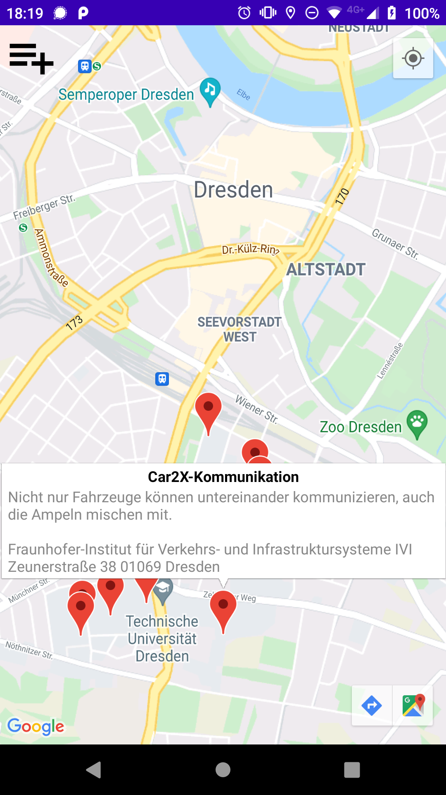

# iCalMap .ics mapper

iCalMap is an Android app that allows to display the events from an .ics file in Google Maps. It was originally developed to navigate between favorite events of [Lange Nacht der Wissenschaften Dresden](https://www.wissenschaftsnacht-dresden.de/), a science night with various events and tech demos hosted by TU Dresden and local research institutes.

## Build and use
1. Clone source code
1. Paste a valid Google Maps API key in `src/debug/res/values/google_maps_api_example.xml` and save the file as `google_maps_api.xml`
1. Build with Android Studio
1. Enjoy!